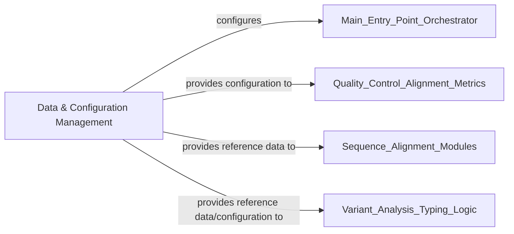

## Details

These components and their relationships highlight a clear data-centric architecture where configuration and reference data are centrally managed and then distributed to the modules that consume them, ensuring consistency and proper execution across the pipeline.

### Data & Configuration Management [[Expand]](./Data_Configuration_Management.md)

This component is responsible for parsing command-line arguments, managing input/output file paths, and providing access to static configuration parameters (e.g., quality thresholds, reference lengths) and essential reference sequences/databases. It acts as the initial setup and data provisioning layer for the entire bioinformatics pipeline.

**Related Classes/Methods**:

- <a href="https://github.com/pfizer-opensource/LISTT/blob/main/src/cmd_parse.py#L1-L1" target="_blank" rel="noopener noreferrer">`src/cmd_parse.py` (1:1)</a>

- `variants/min_cov_metrics.csv` (1:1)

- `variants/thresholds.csv` (1:1)

- `variants/reference_lengths.csv` (1:1)

- `alleles/ref_alleles.fasta` (1:1)

- `ref/ospA_allele_fasta` (1:1)

### [FAQ](https://github.com/CodeBoarding/GeneratedOnBoardings/tree/main?tab=readme-ov-file#faq)