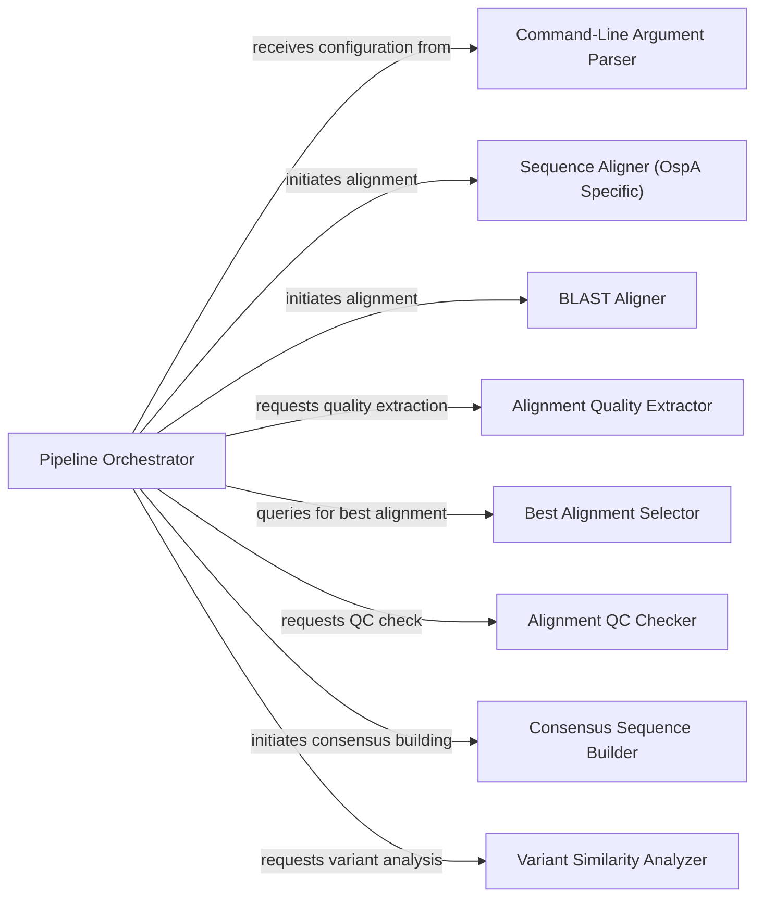

## Details

The Pipeline Orchestrator is the central control unit of the bioinformatics pipeline, managing the overall execution flow based on the input mode (NGS or Assembly). It coordinates various stages by invoking specialized modules for specific tasks, ensuring a proper sequence of operations from initial data processing to final analysis.

### Pipeline Orchestrator [[Expand]](./Pipeline_Orchestrator.md)

The main entry point and coordinator of the entire bioinformatics pipeline. It directs the flow, handles file system setup (e.g., creating output directories), and orchestrates calls to other modules based on the input data type (NGS reads or assembled genomes).

**Related Classes/Methods**:

- `Pipeline Orchestrator` (1:1)

### Command-Line Argument Parser

Responsible for parsing and validating command-line arguments provided by the user, configuring the pipeline's execution parameters and input files.

**Related Classes/Methods**:

- `Command-Line Argument Parser` (1:1)

### Sequence Aligner (OspA Specific)

Performs sequence alignment of raw reads against reference sequences, specifically tailored for OspA gene analysis in NGS mode. It generates alignment files (e.g., BAM, VCF).

**Related Classes/Methods**:

- `Sequence Aligner (OspA Specific)` (1:1)

### BLAST Aligner

Utilizes the BLAST algorithm to align assembled genomes or sequences against a reference database, primarily used in the assembly mode of the pipeline.

**Related Classes/Methods**:

- `BLAST Aligner` (1:1)

### Alignment Quality Extractor

Extracts and processes quality metrics from variant call format (VCF) files generated during the alignment stage, providing data for downstream quality control.

**Related Classes/Methods**:

- `Alignment Quality Extractor` (1:1)

### Best Alignment Selector

Analyzes multiple alignment results and determines the optimal alignment based on predefined quality criteria, ensuring the most reliable data is used for subsequent steps.

**Related Classes/Methods**:

- `Best Alignment Selector` (1:1)

### Alignment QC Checker

Performs quality control checks on the selected best alignment, evaluating metrics such as coverage to ensure the alignment meets the required quality thresholds for further analysis.

**Related Classes/Methods**:

- `Alignment QC Checker` (1:1)

### Consensus Sequence Builder

Constructs a consensus sequence from the aligned reads or assembled genome, incorporating variant information to generate a representative sequence.

**Related Classes/Methods**:

- `Consensus Sequence Builder` (1:1)

### Variant Similarity Analyzer

Compares the generated consensus sequence against known variants or reference sequences to determine serotype, species, or other relevant genetic characteristics.

**Related Classes/Methods**:

- `Variant Similarity Analyzer` (1:1)

### [FAQ](https://github.com/CodeBoarding/GeneratedOnBoardings/tree/main?tab=readme-ov-file#faq)