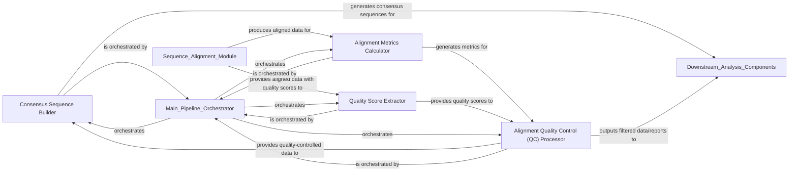

## Details

The `Post-Alignment Processing & Quality Control` component is a crucial stage in the bioinformatics pipeline, focusing on refining and validating aligned sequencing data. It ensures the accuracy and reliability of the data before downstream analyses.

### Consensus Sequence Builder

This component is responsible for constructing high-quality consensus sequences from aligned reads. It likely involves algorithms to resolve discrepancies, handle indels, and determine the most probable base at each position, resulting in a single, representative sequence.

**Related Classes/Methods**:

- `Consensus Sequence Builder`

### Alignment Metrics Calculator

This component calculates various metrics to assess the quality and characteristics of the alignments. This includes metrics such as read counts, coverage depth, mapping quality, and potentially error rates. These metrics are vital for evaluating the success of the alignment process and identifying potential issues.

**Related Classes/Methods**:

- `Alignment Metrics Calculator`

### Alignment Quality Control (QC) Processor

This component performs overall quality control on the aligned data. It likely integrates the metrics calculated by the `Alignment Metrics Calculator` and applies predefined criteria to filter, flag, or select the "best" alignments. This could involve removing low-quality alignments, identifying regions of low coverage, or ensuring data meets specific thresholds.

**Related Classes/Methods**:

- `Alignment Quality Control (QC) Processor`

### Quality Score Extractor

This component is specifically designed to extract and potentially process quality scores associated with sequencing reads or aligned bases. Quality scores are crucial for assessing the confidence of base calls and are often used in conjunction with alignment metrics for more nuanced quality control.

**Related Classes/Methods**:

- `Quality Score Extractor`

### [FAQ](https://github.com/CodeBoarding/GeneratedOnBoardings/tree/main?tab=readme-ov-file#faq)