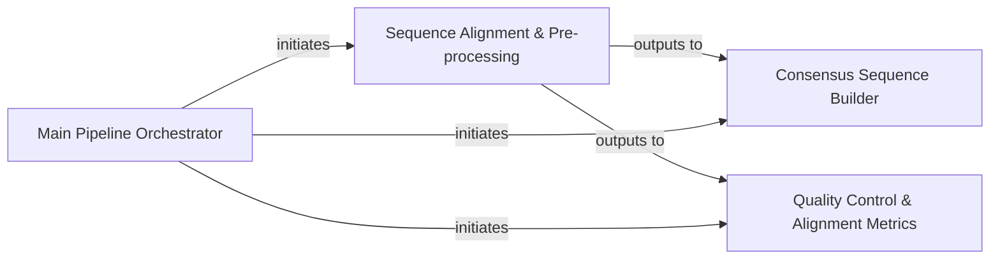

## Details

One paragraph explaining the functionality which is represented by this graph. What the main flow is and what is its purpose.

### Main Pipeline Orchestrator

This component serves as the central control unit for the entire bioinformatics pipeline. It is responsible for parsing command-line arguments, coordinating the execution of various pipeline stages, and managing the overall workflow. It acts as the entry point for the application.

**Related Classes/Methods**:

- <a href="https://github.com/pfizer-opensource/LISTT/blob/main/src/run_pipe.py#L1-L1" target="_blank" rel="noopener noreferrer">`run_pipe` (1:1)</a>

- <a href="https://github.com/pfizer-opensource/LISTT/blob/main/src/cmd_parse.py#L1-L1" target="_blank" rel="noopener noreferrer">`cmd_parse` (1:1)</a>

### Sequence Alignment & Pre-processing [[Expand]](./Sequence_Alignment_Pre_processing.md)

This component handles the initial processing of raw sequence data. It performs sequence alignment against reference genomes or databases, generating alignment files (e.g., BAM/SAM). It supports both NGS and Assembly modes, preparing data for downstream analysis.

**Related Classes/Methods**:

- <a href="https://github.com/pfizer-opensource/LISTT/blob/main/src/align_to_refs.py#L1-L1" target="_blank" rel="noopener noreferrer">`align_to_refs` (1:1)</a>

- <a href="https://github.com/pfizer-opensource/LISTT/blob/main/src/blast_align.py#L1-L1" target="_blank" rel="noopener noreferrer">`blast_align` (1:1)</a>

- <a href="https://github.com/pfizer-opensource/LISTT/blob/main/src/ospA_aligner.py#L1-L1" target="_blank" rel="noopener noreferrer">`ospA_aligner` (1:1)</a>

### Consensus Sequence Builder

This component is responsible for constructing consensus sequences from aligned sequence data. After reads are aligned to a reference, this component aggregates the aligned information to derive a single, representative sequence for each region.

**Related Classes/Methods**:

- <a href="https://github.com/pfizer-opensource/LISTT/blob/main/src/build_consensus.py#L1-L1" target="_blank" rel="noopener noreferrer">`build_consensus` (1:1)</a>

### Quality Control & Alignment Metrics

This component performs quality control checks on the aligned sequence data and generates various metrics to assess the quality of alignments. This helps in identifying potential issues with sequencing data or alignment process.

**Related Classes/Methods**:

- <a href="https://github.com/pfizer-opensource/LISTT/blob/main/src/alignment_metrics.py#L1-L1" target="_blank" rel="noopener noreferrer">`alignment_metrics` (1:1)</a>

- <a href="https://github.com/pfizer-opensource/LISTT/blob/main/src/pull_qual.py#L1-L1" target="_blank" rel="noopener noreferrer">`pull_qual` (1:1)</a>

- <a href="https://github.com/pfizer-opensource/LISTT/blob/main/src/qc_alignments.py#L1-L1" target="_blank" rel="noopener noreferrer">`qc_alignments` (1:1)</a>

### [FAQ](https://github.com/CodeBoarding/GeneratedOnBoardings/tree/main?tab=readme-ov-file#faq)