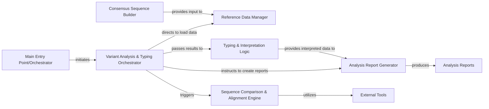

## Details

One paragraph explaining the functionality which is represented by this graph. What the main flow is and what is its purpose.

### Consensus Sequence Builder

This component is responsible for generating the consensus sequence from raw sequencing reads. It processes the input sequencing data to produce a high-quality consensus sequence, which then serves as the primary query input for the downstream variant analysis and typing pipeline.

**Related Classes/Methods**:

- <a href="https://github.com/pfizer-opensource/LISTT/blob/main/src/build_consensus.py" target="_blank" rel="noopener noreferrer">`src.build_consensus`</a>

### Variant Analysis & Typing Orchestrator

This is the central control component for the entire variant analysis and typing stage, primarily embodied by the `VariantSimilarity` class. It orchestrates the workflow, coordinating the loading of input data and references, initiating sequence comparisons and alignments, processing results (including variant and serotype determination), and triggering report generation. It ensures the seamless execution of all sub-tasks within this pipeline segment.

**Related Classes/Methods**:

- <a href="https://github.com/pfizer-opensource/LISTT/blob/main/src/align_to_refs.py#L18-L152" target="_blank" rel="noopener noreferrer">`src.align_to_refs.VariantSimilarity` (18:152)</a>

- <a href="https://github.com/pfizer-opensource/LISTT/blob/main/src/align_to_refs.py#L127-L152" target="_blank" rel="noopener noreferrer">`src.align_to_refs.VariantSimilarity.run` (127:152)</a>

### Reference Data Manager

Responsible for handling the input query consensus sequence and loading the comprehensive database of known reference variants along with their associated serotypes. This component ensures that all necessary comparative data is correctly loaded, parsed, and made available for the downstream analysis.

**Related Classes/Methods**:

- <a href="https://github.com/pfizer-opensource/LISTT/blob/main/src/align_to_refs.py#L34-L44" target="_blank" rel="noopener noreferrer">`src.align_to_refs.VariantSimilarity.load_query` (34:44)</a>

- <a href="https://github.com/pfizer-opensource/LISTT/blob/main/src/align_to_refs.py#L46-L51" target="_blank" rel="noopener noreferrer">`src.align_to_refs.VariantSimilarity.load_refs` (46:51)</a>

- <a href="https://github.com/pfizer-opensource/LISTT/blob/main/src/align_to_refs.py#L53-L58" target="_blank" rel="noopener noreferrer">`src.align_to_refs.VariantSimilarity.import_serotypes` (53:58)</a>

### Sequence Comparison & Alignment Engine

This component performs the core computational task of comparing the query sequence against the reference sequences. It first attempts a rapid direct match. If no direct match is found, it orchestrates the execution of external multiple sequence alignment tools (e.g., MAFFT) to align the sequences and subsequently calculates sequence identity scores from these alignments.

**Related Classes/Methods**:

- <a href="https://github.com/pfizer-opensource/LISTT/blob/main/src/align_to_refs.py#L60-L64" target="_blank" rel="noopener noreferrer">`src.align_to_refs.VariantSimilarity.calc_identity` (60:64)</a>

- <a href="https://github.com/pfizer-opensource/LISTT/blob/main/src/align_to_refs.py#L75-L90" target="_blank" rel="noopener noreferrer">`src.align_to_refs.VariantSimilarity.run_mafft` (75:90)</a>

- <a href="https://github.com/pfizer-opensource/LISTT/blob/main/src/align_to_refs.py#L93-L114" target="_blank" rel="noopener noreferrer">`src.align_to_refs.VariantSimilarity.align_seqs` (93:114)</a>

### Typing & Interpretation Logic

This component encapsulates the specific business logic to interpret the results from the sequence comparison and alignment. It determines the closest known variant based on the calculated identity scores and assigns the corresponding serotype and species. This logic is integrated within the `VariantSimilarity.run` method, where computational results are translated into meaningful biological conclusions.

**Related Classes/Methods**:

- <a href="https://github.com/pfizer-opensource/LISTT/blob/main/src/align_to_refs.py#L127-L152" target="_blank" rel="noopener noreferrer">`src.align_to_refs.VariantSimilarity.run` (127:152)</a>

### Analysis Report Generator

Responsible for compiling, formatting, and writing the final output report. This report summarizes the variant analysis results, including the identified variant, its similarity to reference sequences, and the assigned typing information, making the findings accessible to the user.

**Related Classes/Methods**:

- <a href="https://github.com/pfizer-opensource/LISTT/blob/main/src/align_to_refs.py#L116-L125" target="_blank" rel="noopener noreferrer">`src.align_to_refs.VariantSimilarity.write_report` (116:125)</a>

### Main Entry Point/Orchestrator

Represents the main entry point or orchestrator of the system.

**Related Classes/Methods**: _None_

### External Tools

Represents external tools utilized by the system.

**Related Classes/Methods**: _None_

### Analysis Reports

Represents the final analysis reports generated by the system.

**Related Classes/Methods**: _None_

### [FAQ](https://github.com/CodeBoarding/GeneratedOnBoardings/tree/main?tab=readme-ov-file#faq)