```mermaid

graph LR

    Pipeline_Orchestrator["Pipeline Orchestrator"]

    Data_Configuration_Management["Data & Configuration Management"]

    Sequence_Alignment_Pre_processing["Sequence Alignment & Pre-processing"]

    Post_Alignment_Processing_Quality_Control["Post-Alignment Processing & Quality Control"]

    Variant_Analysis_Typing["Variant Analysis & Typing"]

    Pipeline_Orchestrator -- "Controls" --> Data_Configuration_Management

    Pipeline_Orchestrator -- "Orchestrates" --> Sequence_Alignment_Pre_processing

    Pipeline_Orchestrator -- "Orchestrates" --> Post_Alignment_Processing_Quality_Control

    Pipeline_Orchestrator -- "Orchestrates" --> Variant_Analysis_Typing

    Variant_Analysis_Typing -- "Outputs Typing Results To" --> Pipeline_Orchestrator

    Data_Configuration_Management -- "Provides Configuration To" --> Pipeline_Orchestrator

    Data_Configuration_Management -- "Supplies Reference Data To" --> Sequence_Alignment_Pre_processing

    Data_Configuration_Management -- "Supplies Parameters To" --> Post_Alignment_Processing_Quality_Control

    Data_Configuration_Management -- "Supplies Reference Alleles To" --> Variant_Analysis_Typing

    Sequence_Alignment_Pre_processing -- "Generates Aligned Data For" --> Post_Alignment_Processing_Quality_Control

    Sequence_Alignment_Pre_processing -- "Generates Raw Variants For" --> Variant_Analysis_Typing

    Post_Alignment_Processing_Quality_Control -- "Produces Refined Data For" --> Variant_Analysis_Typing

    Post_Alignment_Processing_Quality_Control -- "Provides Quality Metrics To" --> Pipeline_Orchestrator

    click Pipeline_Orchestrator href "https://github.com/pfizer-opensource/LISTT/blob/main/.codeboarding//Pipeline_Orchestrator.md" "Details"

    click Data_Configuration_Management href "https://github.com/pfizer-opensource/LISTT/blob/main/.codeboarding//Data_Configuration_Management.md" "Details"

    click Sequence_Alignment_Pre_processing href "https://github.com/pfizer-opensource/LISTT/blob/main/.codeboarding//Sequence_Alignment_Pre_processing.md" "Details"

    click Post_Alignment_Processing_Quality_Control href "https://github.com/pfizer-opensource/LISTT/blob/main/.codeboarding//Post_Alignment_Processing_Quality_Control.md" "Details"

    click Variant_Analysis_Typing href "https://github.com/pfizer-opensource/LISTT/blob/main/.codeboarding//Variant_Analysis_Typing.md" "Details"

```

## Details

High-level data flow overview of the LISTT bioinformatics pipeline. Project Type: Bioinformatics Pipeline. Architectural Patterns: Pipeline Architecture, Modular Design, Command-Line Interface (CLI) Application, Data-Centric Architecture, External Tool Orchestration.

### Pipeline Orchestrator [[Expand]](./Pipeline_Orchestrator.md)

The central control unit that manages the overall execution flow of the bioinformatics pipeline. It coordinates different stages based on the input mode (NGS or Assembly) and ensures proper sequencing of operations.

**Related Classes/Methods**:

- <a href="https://github.com/pfizer-opensource/LISTT/blob/main/src/run_pipe.py#L1-L1" target="_blank" rel="noopener noreferrer">`src/run_pipe.py` (1:1)</a>

### Data & Configuration Management [[Expand]](./Data_Configuration_Management.md)

Handles command-line argument parsing, loads various configuration parameters (e.g., quality thresholds, reference lengths), manages input/output paths, and provides access to all necessary reference sequences and pre-indexed databases.

**Related Classes/Methods**:

- <a href="https://github.com/pfizer-opensource/LISTT/blob/main/src/cmd_parse.py#L1-L1" target="_blank" rel="noopener noreferrer">`src/cmd_parse.py` (1:1)</a>

- `variants/min_cov_metrics.csv` (1:1)

- `variants/thresholds.csv` (1:1)

- `variants/reference_lengths.csv` (1:1)

- `alleles/ref_alleles.fasta` (1:1)

- `ref/ospA_allele_fasta` (1:1)

### Sequence Alignment & Pre-processing [[Expand]](./Sequence_Alignment_Pre_processing.md)

Performs the initial processing of raw sequence data. This includes aligning raw sequencing reads (for NGS mode) or assembled sequences (for Assembly mode) to specified reference genomes or curated databases, generating alignment files (e.g., BAM/SAM), and performing initial variant calling or sequence curation.

**Related Classes/Methods**:

- <a href="https://github.com/pfizer-opensource/LISTT/blob/main/src/ospA_aligner.py#L1-L1" target="_blank" rel="noopener noreferrer">`src/ospA_aligner.py` (1:1)</a>

- <a href="https://github.com/pfizer-opensource/LISTT/blob/main/src/blast_align.py#L1-L1" target="_blank" rel="noopener noreferrer">`src/blast_align.py` (1:1)</a>

### Post-Alignment Processing & Quality Control [[Expand]](./Post_Alignment_Processing_Quality_Control.md)

Refines and assesses the quality of aligned data. This component constructs high-quality consensus sequences from aligned reads or processed variant calls and evaluates alignment quality by calculating various metrics (e.g., read counts, coverage), selecting the "best" alignment based on predefined criteria.

**Related Classes/Methods**:

- <a href="https://github.com/pfizer-opensource/LISTT/blob/main/src/build_consensus.py#L1-L1" target="_blank" rel="noopener noreferrer">`src/build_consensus.py` (1:1)</a>

- <a href="https://github.com/pfizer-opensource/LISTT/blob/main/src/alignment_metrics.py#L1-L1" target="_blank" rel="noopener noreferrer">`src/alignment_metrics.py` (1:1)</a>

- <a href="https://github.com/pfizer-opensource/LISTT/blob/main/src/qc_alignments.py#L1-L1" target="_blank" rel="noopener noreferrer">`src/qc_alignments.py` (1:1)</a>

- <a href="https://github.com/pfizer-opensource/LISTT/blob/main/src/pull_qual.py#L1-L1" target="_blank" rel="noopener noreferrer">`src/pull_qual.py` (1:1)</a>

### Variant Analysis & Typing [[Expand]](./Variant_Analysis_Typing.md)

The final analytical stage of the pipeline. It analyzes genetic variants, compares query sequences or identified variants to known reference alleles, and performs typing or determines similarity based on these comparisons, generating the ultimate biological insights.

**Related Classes/Methods**:

- <a href="https://github.com/pfizer-opensource/LISTT/blob/main/src/align_to_refs.py#L1-L1" target="_blank" rel="noopener noreferrer">`src/align_to_refs.py` (1:1)</a>

### [FAQ](https://github.com/CodeBoarding/GeneratedOnBoardings/tree/main?tab=readme-ov-file#faq)